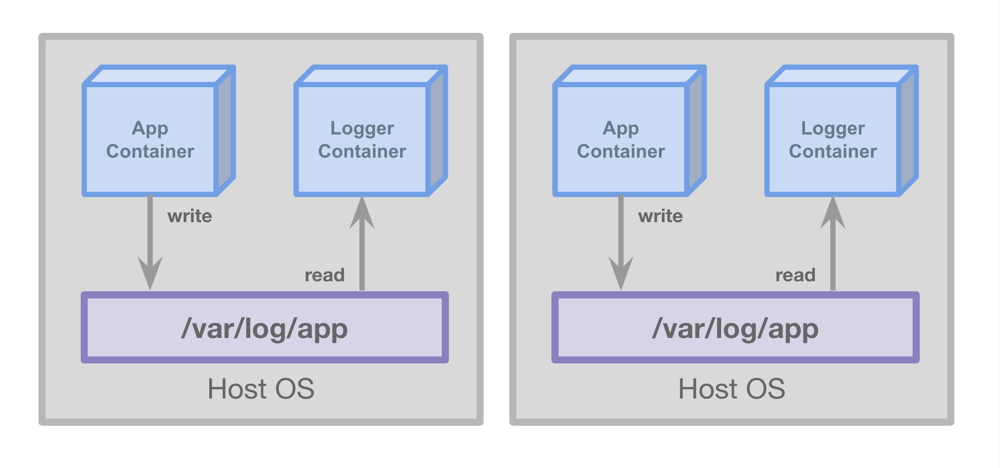

## Volumeについて


ボリュームはデータを永続化するための機能です。

Docker Containerは基本的にエフェメラルなもので、コンテナ上で作成されたファイルはコンテナのライフサイクルの終了と共に消えてしまいます。  
Volumeはデータ保持・永続化のために設計されており、コンテナのライフサイクルとは独立してファイルの管理を行います。  
例えばfluentdのようなロガーでロギングをしたい場合がイメージしやすいとおもいます。  

## Volume Type
Volumeは2つの種類が存在します。

### Data Volume
Docker Container のライフサイクルの外で管理されるファイル/ディレクトリの設定です。

### オプション
#### `-v <CONTAINER PATH>`

`/tmp/text` をボリュームとして実行後、volumeが作成された確認してみます。
```
$ docker run -v /tmp/text ubuntu touch /tmp/text/hogefugapiyo
$ docker volume ls
DRIVER              VOLUME NAME
local               ec960f53dd549aa8d771ae12b8f489b218c39fd8aea98baa2c9dca00731f245c
```

詳細を取得して、volumeの実体を見に行きましょう。  
```
$ docker volume inspect ec960f53dd549aa8d771ae12b8f489b218c39fd8aea98baa2c9dca00731f245c
[
    {
        "CreatedAt": "2019-03-18T18:34:15Z",
        "Driver": "local",
        "Labels": null,
        "Mountpoint": "/var/lib/docker/volumes/ec960f53dd549aa8d771ae12b8f489b218c39fd8aea98baa2c9dca00731f245c/_data",
        "Name": "ec960f53dd549aa8d771ae12b8f489b218c39fd8aea98baa2c9dca00731f245c",
        "Options": null,
        "Scope": "local"
    }
]
```

`docker volume inspect` コマンドから `Mountpoint` が取得できています。  
早速アクセスしてみましょう。

```
$ ls -l /var/lib/docker/volumes/b29ba9e3f10d67d8fd81718dbd346ff0992832a2bd9927087a6c8c0fe8f29
32a/_data
total 0
-rw-r--r--    1 root     root             0 Mar 18 18:38 hoge
```

Volumeはこのようにコンテナの外側へファイルが補完されます。


#### `-v <HOST PATH>:<CONTAINER PATH>`
先程は `<CONTAINER PATH>` だけ指定しましたが、今度はホスト側のパスを指定します。  
このように `:` で区切ることで左に指定したホストのパスを右に指定したコンテナのパスと共有するという意味になります。

このコマンドはデバッグ時に便利で、ホストのコードをコンテナへ同期させて動作確認することによく使います。

### Data Volume Container
他のDocker Container で指定されているVolumeを参照するための機能です。

参照元となるコンテナを `volume-test` という名前で作成し、その中でファイルを3つ作ってみます。
```
$ docker run --name volume-test -v /tmp/test ubuntu touch /tmp/test/{hoge,fuga,piyo}
```

新しくコンテナを起動して、 `volume-test` コンテナのファイルへアクセスできるか確認してみます。

まずはオプションを設定せずに `ls` を実行し、存在しないことを確認しましょう。
```
$ docker run ubuntu ls -l /tmp/test
ls: cannot access '/tmp/test': No such file or directory
```

次に `--volumes-from` オプションで先程作成した `volume-test` を指定して、 `ls` を実行します。
```
$ docker run --volumes-from volume-test ubuntu ls -l /tmp/test
total 0
-rw-r--r-- 1 root root 0 Mar 18 18:49 fuga
-rw-r--r-- 1 root root 0 Mar 18 18:49 hoge
-rw-r--r-- 1 root root 0 Mar 18 18:49 piyo
```

コンテナ間でVolumeの共有ができました。
    
## まとめ
- データの永続化にVolumeを使用する
- コンテナ間でVolumeの共有は可能
- Dockerはエフェメラルになるような設計を求められるため、基本的にVolumeは使用しないことが好ましい。
